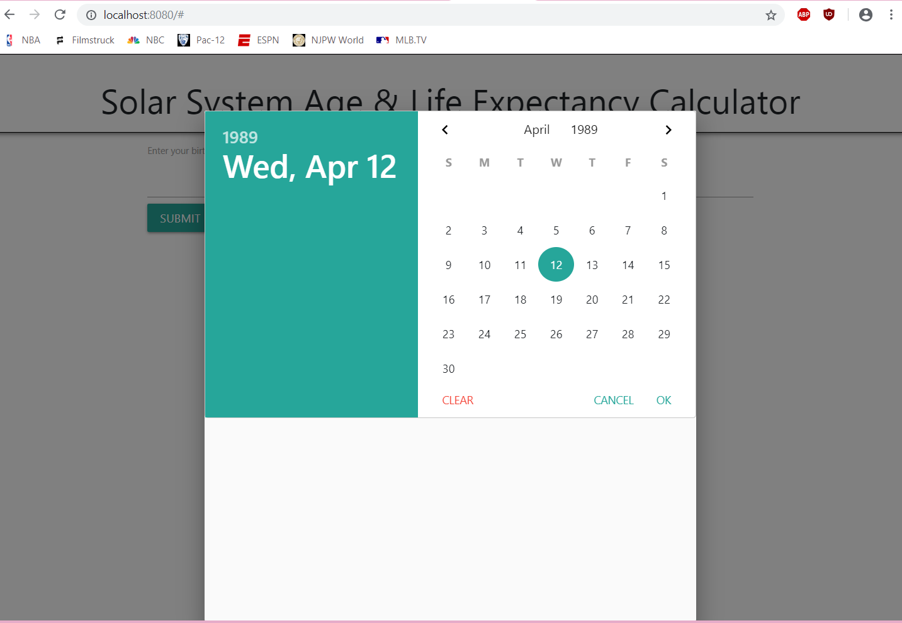
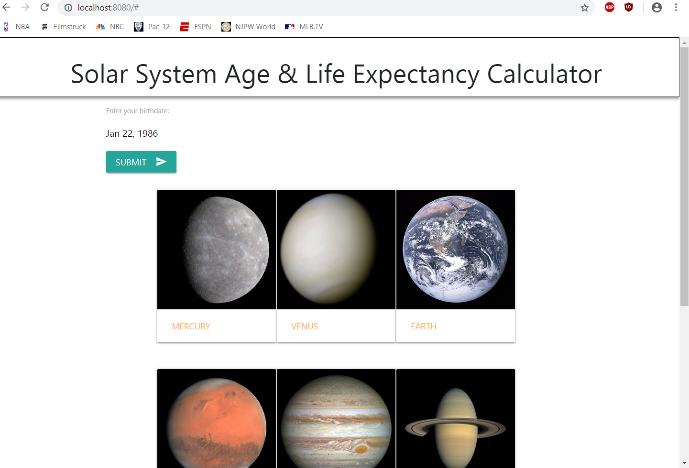
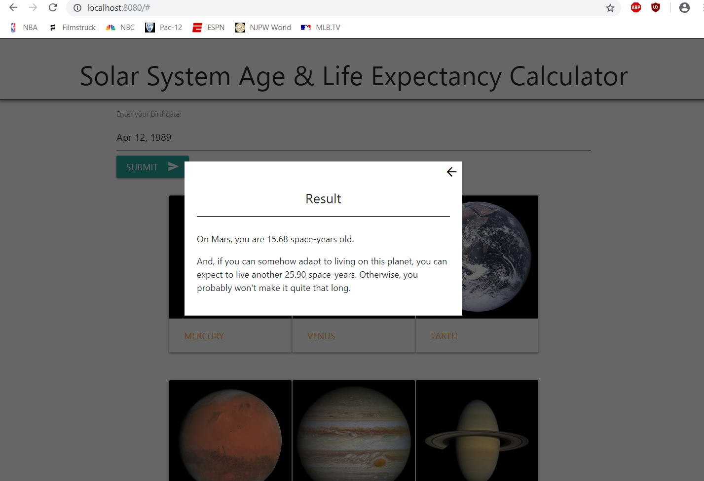

# Solar System Age Calculator

### _Created By_ **Joe Friesen**

## Description

This page, given a birthdate supplied by the user, will calculate that person's age and life expectancy on any planet in the solar system.

## Screenshots






## Technologies Employed

* HTML
* jQuery
* JavaScript
* Materialize-CSS
* Webpack
* Jasmine / Karma Spec Testing

## Installation Instructions

* In terminal, enter the following:
```
$ cd ~/desktop
$ git clone https://github.com/josephfriesen/solar-system-age-calc.git
$ cd solar-system-age-calc
$ npm run start
```

### Legal

Copyright (c) 2018 [Joseph Friesen](mailto:friesen.josephc@gmail.com)
